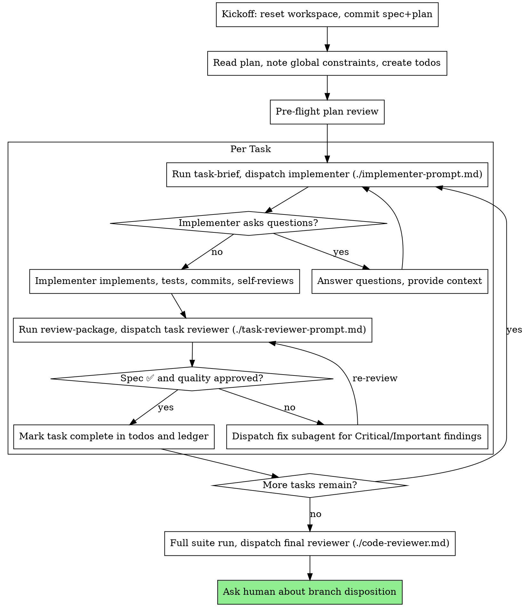

# Subagent-Driven Development

Execute a plan by dispatching a fresh implementer subagent per task, a task
review (spec compliance + code quality) after each, and one broad
whole-branch review at the end.

Subagents never inherit your session's context: you construct exactly what
each one needs. That keeps them focused and preserves your context for
coordination.

**Continuous execution:** do not pause between tasks to check in. Stop only
for a BLOCKED status you cannot resolve, ambiguity that prevents progress,
or completion. Between tool calls, narrate at most one short line - the
ledger and tool results carry the record.

## The Process

## Kickoff

Execution start is when the spec and plan are finalized; brainstorming and
writing-plans leave them uncommitted so drafts don't spam history.

1. Check for a ledger (see Durable Progress). If one lists completed tasks,
   this is a resume: skip steps 2-3 and continue at the first incomplete
   task.
2. Clear earlier runs' artifacts: `scripts/sdd-workspace --reset`. Stale
   briefs, diffs, and reports otherwise surface in reviewers' greps.
3. Make ONE docs-only commit with the spec and plan (e.g. `docs: spec and
   plan for <feature>`) BEFORE recording Task 1's base SHA, or every review
   package drags the plan in. Commit later plan amendments as they happen.

Never start on main/master without explicit user consent.

## Pre-Flight Plan Review

Before Task 1, scan the plan once for tasks that contradict each other or
the Global Constraints, and for anything the plan mandates that the review
rubric treats as a defect (a test that asserts nothing, a duplicated logic
block). Present all findings as one batched question, each beside the plan
text that mandates it, asking which governs. If the scan is clean, proceed
without comment.

## Model Selection

- **Implementers and fix subagents: Sonnet** (mid tier). A well-specified
  plan makes implementation mechanical enough for it, and cheaper models
  take 2-3x the turns.
- **Task reviewers and re-reviewers: Opus** (strong tier).
- **Final whole-branch reviewer and its re-reviews: the strongest available
  model** - Fable if the Agent tool offers it, else Opus. It is the one
  dispatch that sees the whole branch.

Only sanctioned deviation: a Sonnet implementer BLOCKED on reasoning depth
is re-dispatched on Opus. Always set the model explicitly - an omitted
model inherits your session's, often the most expensive. If the lineup
changes, map by tier.

## Dispatching an Implementer

Run `scripts/task-brief PLAN_FILE N`; it writes the task's text to a file
and prints the path. Fill [implementer-prompt.md](implementer-prompt.md)
with:

- one line on where the task fits;
- the brief path - the single source of requirements, so exact values
  (numbers, strings, signatures, test cases) appear only there;
- interfaces and decisions from earlier tasks that the brief cannot know,
  and your resolution of any ambiguity you noticed;
- the report path, named after the brief (`task-N-brief.md` ->
  `task-N-report.md`);
- the exact Co-Authored-By line from your own session's attribution, or
  subagents substitute their own model name.

A dispatch describes one task, not the session's history: never paste
accumulated summaries of earlier tasks.

## Handling Implementer Status

- **DONE:** run `scripts/review-package BASE HEAD` (BASE = the SHA you
  recorded before dispatching, never `HEAD~1`, which drops all but the
  last commit) and dispatch the task reviewer with the printed path.
- **DONE_WITH_CONCERNS:** read the concerns. Resolve correctness or scope
  doubts before review; note observations and proceed.
- **NEEDS_CONTEXT:** provide it and re-dispatch.
- **BLOCKED:** add context and re-dispatch on the same model; or move to a
  stronger model if it needs more reasoning; or split the task if it is too
  large; or escalate to the human if the plan is wrong. Never retry
  unchanged.
- **No report (the subagent died):** inspect `git status`, `git diff`, and
  the report file. If the edits are complete and the covering tests pass,
  commit and proceed to review. Otherwise resume the same agent
  (SendMessage) with what is done, what remains, and which tests fail - a
  fresh dispatch collides with the half-finished work.

## Task Review

Fill [task-reviewer-prompt.md](task-reviewer-prompt.md) with the brief
path, the report path, the review-package path, and the global constraints
that bind the task, copied verbatim (exact values, formats, stated
relationships between components). The template carries the process rules.

- Do not ask the reviewer to re-run tests the implementer ran, and add no
  open-ended directives ("check all uses") without a task-specific reason.
- Never pre-judge: if your prompt contains "do not flag", "at most Minor",
  or "the plan chose", you are sparing yourself a review loop. Let the
  reviewer raise it and adjudicate afterwards.

## Handling Findings

Findings are claims, not verdicts. Verify each against the code before
acting, push back with technical reasoning when one is wrong, and never
respond performatively ("Great catch!"). If a finding is unclear, get it
clarified before fixing anything - findings are often related, and partial
understanding produces wrong fixes. Treat an implementer's rebuttal the
same way.

- **Critical and Important:** one fix subagent with the complete list, then
  a re-review. The dispatch carries the same Co-Authored-By line as the
  implementer's and names the covering test files; the fixer
  re-runs only those and appends command and output to the report file.
  Re-dispatch the reviewer only once that evidence is present.
- **Minor:** never a per-task round-trip. Record each in the ledger; the
  final reviewer triages the list for the final fix wave.
- **⚠️ Cannot verify from diff:** resolve each yourself before marking the
  task complete - you hold the cross-task context. A real gap is a failed
  spec review.
- **Plan-mandated, or conflicting with the plan's text:** the human
  decides. Present the finding beside the plan text.
- **The spec itself is wrong:** decide it yourself if the fix restores the
  spec's stated intent. Ask the human (one batched question with a
  recommendation) when it changes a published default, a threshold, or an
  output's meaning. Either way, record a design correction.

Never move to the next task while Critical or Important findings are open.

## Final Review

1. If the branch adds a statistical gate or self-check, run it over ~100
   seeds and report the failure rate; 1-2% failures at default config is a
   defect.
2. Run the full suite and lint once at HEAD, output to
   `.minipowers/sdd/full-suite-<head7>.txt`.
3. Run `scripts/review-package MERGE_BASE HEAD` (e.g. `git merge-base main
   HEAD`).
4. Dispatch exactly one final reviewer with
   [code-reviewer.md](code-reviewer.md): the package path, the full-suite
   output path, the ledger's Minor list, and a findings file
   (`.minipowers/sdd/review-findings-BASE..HEAD.md`).
5. Findings go to ONE fix subagent with the complete list, then a
   re-review.
6. If fixes changed code since step 2, run the full suite once more.
7. Ask the human once: merge locally, push + PR, or leave as-is. Never
   merge or push without an answer.

If the final review ends without a report, read its findings file first
and re-dispatch only for what it does not cover, handing the file over to
be amended.

## Durable Progress

Conversation memory does not survive compaction; the costliest observed
failure is re-dispatching completed tasks. Keep a ledger at
`.minipowers/sdd/progress.md`:

- At start, read it. Tasks marked complete are done - never re-dispatch
  them.
- When a task's review comes back clean, append
  `Task N: complete (commits <base7>..<head7>, review clean)`.
- Record Minor findings under a "Minors" heading as they arrive.
- Record each deviation from the spec under "Design corrections" (what
  changed, why, commit) and edit the local spec file to match. The final
  report to the human lists these.
- After compaction, trust the ledger and `git log` over recollection. If
  `git clean -fdx` destroyed the ledger, recover from `git log`.

## Never

- Skip task review, or accept a review missing either verdict
- Dispatch implementers in parallel - they share one checkout
- Make a subagent read the whole plan - hand it its task brief
- Fix a subagent's work yourself - dispatch a fix subagent
- Let implementer self-review replace the task review
